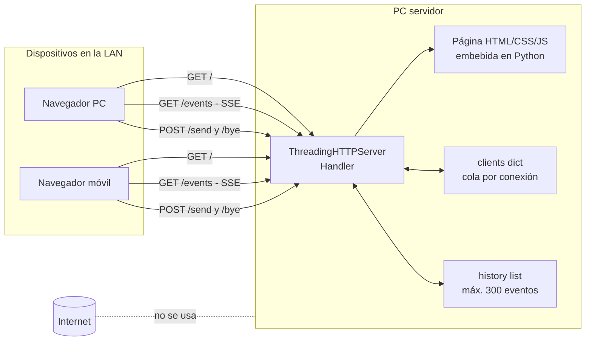
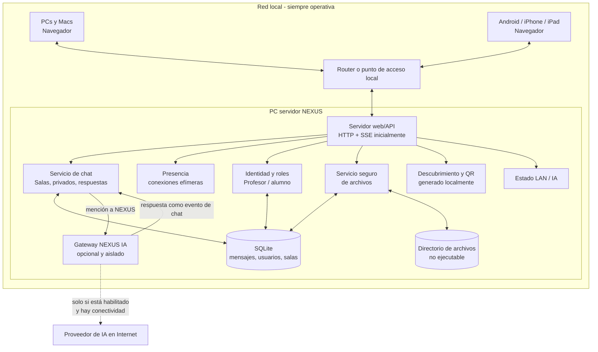
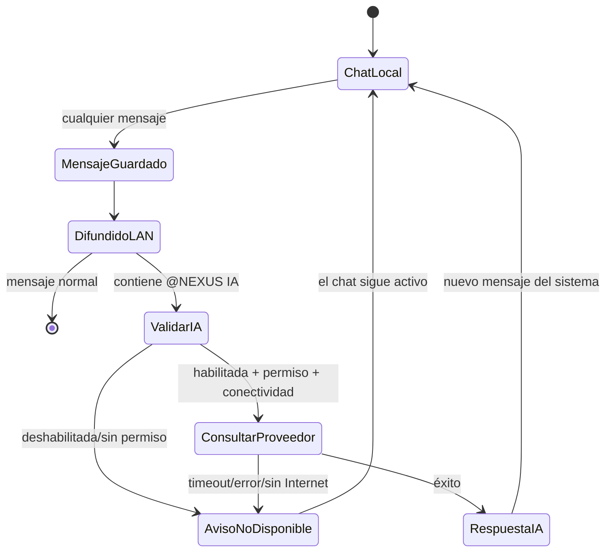

# PLAN NEXUS TEAM CHAT

## Estado de esta auditoría

- Fecha de revisión: 2026-09-18.
- Repositorio: `christopherperezcorteswb-sketch/Chat.ide`.
- Rama y revisión analizadas: `main`, commit `064f955ceaa1802f48e6eaaf1ad00b1ef3fbabdb`.
- Sistema de prueba: Windows, Python 3.13.14, Wi-Fi con dirección `192.168.0.24/24` y perfil de red marcado como **Público**.
- Alcance respetado: se clonó, leyó, ejecutó temporalmente y probó el proyecto. No se modificó el código, no se instalaron ni actualizaron dependencias, no se borraron archivos y no se hicieron commits.
- Única escritura de esta etapa: este documento.

La conclusión principal es favorable: el trabajo existente ya demuestra el concepto central de CHAT.ide. Dos o más navegadores pueden conversar mediante una PC que actúa como servidor, sin servicios externos y sin Internet. Conviene evolucionarlo, no desecharlo. Sin embargo, todavía es un prototipo de una sola sala, sin identidad verificable, persistencia, archivos, permisos ni controles suficientes para una red escolar no confiable.

---

## Clasificación para preservar el trabajo del alumno

### A) Lo que ya funciona

- Servidor web accesible por IPv4 y enlazado a todas las interfaces mediante `0.0.0.0`.
- Interfaz web autocontenida, sin CDN, fuentes remotas ni recursos de Internet.
- Entrada con nombre visible y resolución automática de nombres duplicados.
- Sala general con mensajes de texto.
- Comunicación servidor-cliente en tiempo real mediante Server-Sent Events (SSE).
- Envío cliente-servidor mediante peticiones HTTP `POST`.
- Lista de usuarios conectados en escritorio.
- Avisos de entrada y salida.
- Historial en memoria de los últimos 300 eventos.
- Reconexión automática básica del navegador.
- Límite de 500 caracteres por mensaje y 20 por nombre.
- Interfaz adaptable: en pantallas de hasta 760 px se muestra principalmente el chat.
- Uso de `textContent` para representar nombres y mensajes, lo cual evita la ejecución directa de HTML inyectado en el flujo actual.

### B) Lo que existe, pero está incompleto o es solo representativo

- La estética de Arduino IDE está lograda, pero el editor, sus iconos laterales y el archivo `chat_clase.ino` son decorativos; no existe integración con Arduino.
- El estado “Conectado” indica conexión al servidor local, no disponibilidad de Internet ni de IA.
- “Borrar salida” solo limpia la pantalla de ese navegador; no borra el historial del servidor.
- El historial existe únicamente en RAM, incluye mensajes y eventos del sistema, y desaparece al cerrar el proceso.
- La lista de usuarios existe, pero queda oculta en la vista móvil.
- Se muestran todas las IP detectadas; pueden aparecer adaptadores virtuales no utilizables por los alumnos.
- La identidad se basa en un nombre y un identificador generado por JavaScript, no en una sesión autenticada.
- La reconexión funciona de manera básica, pero una desconexión suficientemente larga puede producir eventos de salida y nueva entrada.
- El `README.md` solo contiene el título del proyecto y no documenta instalación, red, seguridad ni solución de problemas.

### C) Lo que habría que modificar

- Separar gradualmente servidor, interfaz, almacenamiento y servicios, manteniendo inicialmente las rutas y el comportamiento actuales.
- Cambiar el estado global en RAM por servicios con persistencia SQLite y presencia efímera separada.
- Fortalecer el servidor HTTP: límites, tiempos de espera, control de conexiones, validación, cabeceras y registros seguros.
- Introducir sesiones e identidad controlada, además de un rol de profesor.
- Permitir elegir explícitamente la interfaz/IP LAN que se anuncia y proteger el alcance del servidor.
- Hacer visible la presencia en móvil mediante un panel o cajón adaptable.
- Separar los indicadores “red local” e “IA/Internet”.
- Extraer HTML, CSS y JavaScript del literal Python cuando exista una red de pruebas que proteja el comportamiento actual.

### D) Lo que habría que agregar

- Salas/equipos, mensajes privados, respuestas, menciones y moderación.
- Persistencia, migraciones, retención y copias de seguridad locales.
- Carga y descarga segura de imágenes/archivos.
- QR local para la URL seleccionada.
- Estado de salud local y estado independiente del proveedor de IA.
- Adaptador opcional para NEXUS IA, con credenciales solo en el servidor.
- Pruebas automatizadas, documentación operativa y empaquetado para uso sin Internet.
- Controles de inscripción, permisos y administración del profesor.

### E) Lo que no conviene cambiar sin una razón demostrada

- La interfaz visual tipo Arduino, porque es parte distintiva y ya funciona.
- El acceso desde navegador sin instalar una app en cada dispositivo.
- La filosofía local-first y la ausencia de recursos web externos.
- Python como plataforma del servidor, al menos durante la evolución inicial.
- El uso de contenido textual seguro en el DOM (`textContent`).
- El contrato básico “recibir eventos + enviar por HTTP” mientras SSE siga cubriendo la necesidad. No es obligatorio migrar a WebSockets solo por moda.
- `chat_arduino.py`: debería conservarse como lanzador compatible aun si internamente delega más adelante a módulos nuevos.

---

## 1. Resumen de cómo funciona actualmente el proyecto

El repositorio contiene dos archivos:

```text
Chat.ide/
├── README.md          # solo contiene “# Chat.ide”
└── chat_arduino.py    # servidor, estado, HTML, CSS y JavaScript
```

El arranque actual es:

```powershell
python chat_arduino.py
python chat_arduino.py 8080
```

El puerto predeterminado es `8000`. El proceso crea un `ThreadingHTTPServer` en `0.0.0.0`, detecta direcciones IPv4 locales y las imprime. Cada alumno abre una de esas URLs desde el navegador.

Flujo de una sesión:

1. `GET /` entrega una sola página HTML con CSS y JavaScript embebidos.
2. El alumno escribe un nombre.
3. El navegador genera un `cid` local y abre `GET /events?cid=...&name=...`.
4. El servidor mantiene esa conexión SSE y asigna una cola en memoria al cliente.
5. El servidor envía saludo, historial y lista de usuarios.
6. Un mensaje se envía con `POST /send` en JSON.
7. El servidor agrega el evento al historial y lo deposita en la cola de todos los clientes.
8. Al abandonar la página se intenta enviar `POST /bye`; si la conexión se rompe, el ping SSE ayuda al servidor a detectarlo.

Todo el estado vive en dos variables globales protegidas por un `RLock`:

- `clients`: conexiones activas y colas.
- `history`: hasta 300 eventos.

No existe base de datos, almacenamiento en disco, autenticación, carga de archivos ni proveedor externo.

## 2. Diagrama de la arquitectura actual



El sistema usa SSE, no WebSockets. SSE transporta eventos del servidor al navegador; `fetch`/HTTP transporta mensajes del navegador al servidor.

## 3. Tecnologías utilizadas

| Área | Tecnología actual | Observación |
|---|---|---|
| Lenguaje servidor | Python 3 | Sintaxis verificada en Python 3.13.14. |
| Servidor HTTP | `http.server.ThreadingHTTPServer` | Biblioteca estándar; crea un hilo por petición/conexión. |
| Comunicación en vivo | Server-Sent Events (`EventSource`) | Flujo unidireccional servidor-cliente. |
| Envío al servidor | HTTP `POST` + JSON + `fetch` | Rutas `/send` y `/bye`. |
| Frontend | HTML5, CSS y JavaScript nativo | Embebido en `chat_arduino.py`. |
| Diseño adaptable | CSS Grid y `@media (max-width: 760px)` | El chat es utilizable en pantallas pequeñas, pero oculta la lista de conectados. |
| Estado de cliente | DOM y `localStorage` | Solo persiste el último nombre. |
| Almacenamiento servidor | Listas/diccionarios en RAM | Sin persistencia. |
| Dependencias de terceros | Ninguna | No hay `requirements.txt`, `pyproject.toml` ni paquetes externos. |
| Autenticación | Ninguna | Nombre declarado por el propio usuario. |
| Cifrado | Ninguno | HTTP plano dentro de la LAN. |

Compatibilidad razonable por diseño: navegadores modernos de Windows, macOS, Android, iPhone y iPad implementan las capacidades utilizadas (`EventSource`, `fetch`, `Blob`, `sendBeacon`, CSS Grid y JavaScript moderno). Esto se deduce de los estándares usados; en esta auditoría no hubo dispositivos físicos Android/iOS disponibles, por lo que aún hace falta una matriz de pruebas reales.

## 4. Qué funciona actualmente

### Resultado de pruebas seguras

Se levantó temporalmente el proceso en el puerto `18765`, se probó desde `localhost` y luego se cerró. No se escribieron datos del proyecto. Pasaron 15 de 15 comprobaciones:

1. `GET /` devuelve HTML y metadatos para móvil.
2. Tipo de contenido HTML UTF-8 correcto.
3. La página principal se marca `no-store`.
4. `favicon.ico` devuelve 204.
5. Rutas inexistentes devuelven 404.
6. Un `cid` no registrado no puede enviar y recibe 403.
7. JSON inválido recibe 400.
8. Un cuerpo mayor de 4096 bytes se rechaza.
9. Un cliente recibe saludo e historial mediante SSE.
10. Un nombre repetido se convierte en `Nombre (2)`.
11. La lista de conectados se difunde a los clientes.
12. Un mensaje válido llega con autor y marca de tiempo.
13. Un texto parecido a HTML permanece como datos; los saltos se normalizan.
14. Un mensaje largo se trunca a 500 caracteres.
15. La salida actualiza la presencia.

La protección XSS del flujo visible se comprobó con texto similar a ``: el servidor lo trató como texto y el frontend lo inserta con `textContent`, no con `innerHTML`.

### Comportamiento offline actual

Una vez que Python y el archivo están en la PC servidor, el programa no necesita Internet para arrancar, servir la página o intercambiar mensajes. Tampoco necesita DNS: los clientes pueden usar directamente `http://IP:PUERTO`.

## 5. Problemas encontrados

### Funcionales y de mantenibilidad

- Código monolítico: servidor, estado, presentación y lógica de navegador están en un archivo de 547 líneas.
- `README.md` insuficiente.
- No hay pruebas automatizadas en el repositorio.
- No hay persistencia ni recuperación después de reiniciar.
- No hay salas, privados, respuestas, menciones, archivos, imágenes, administración ni IA.
- El historial tiene un límite global de 300 **eventos**, no 300 mensajes por sala.
- No existen IDs estables de mensajes, necesarios para respuestas, edición, moderación y deduplicación.
- El nombre no equivale a una identidad; cualquiera puede llamarse “Profesor” o usar caracteres visualmente engañosos.
- El estado “Conectado” no distingue LAN, servidor, Internet e IA.
- En móvil se ocultan los conectados y el resto de la navegación.
- El proceso imprime también interfaces virtuales. En la prueba mostró `172.26.96.1` (WSL/Hyper-V) y `192.168.0.24` (Wi-Fi); solo la segunda era la candidata normal para alumnos.
- Un puerto no numérico falla antes de mostrar una explicación amigable.
- No hay servicio del sistema, inicio automático, bandeja, instalador ni ejecutable empaquetado.
- No hay endpoint formal de salud ni diagnóstico de red.
- Se suprime todo registro HTTP normal, lo que dificulta diagnosticar problemas y auditar abusos.

### Operación en red

- Escuchar en `0.0.0.0` expone el servicio en Wi-Fi, Ethernet y adaptadores virtuales disponibles.
- En la PC auditada, Windows clasifica el Wi-Fi como red **Pública**. El firewall puede bloquear conexiones entrantes aunque `localhost` funcione.
- Estar en el mismo nombre de Wi-Fi no garantiza conectividad: algunos puntos de acceso activan aislamiento entre clientes.
- La IP puede cambiar por DHCP y hacer obsoleto un QR previamente generado.
- La PC servidor es un punto único de fallo. “Sin Internet” sí funciona; “sin servidor” no puede funcionar con esta arquitectura.
- No se realizó una conexión desde otro dispositivo físico durante esta auditoría, así que aún debe verificarse firewall y aislamiento del punto de acceso.

## 6. Riesgos de seguridad

La LAN escolar debe tratarse como una red potencialmente hostil. “Solo local” reduce exposición, pero no sustituye identidad, límites ni permisos.

| Riesgo actual | Nivel | Evidencia/impacto | Tratamiento recomendado |
|---|---:|---|---|
| Sin autenticación ni roles | Alto | Cualquier equipo alcanzable entra, observa y escribe. No hay profesor verificable. | Inscripción mediante código temporal/QR, sesiones de servidor y roles. |
| HTTP sin cifrado | Alto si la LAN no es confiable | Mensajes y futuras credenciales pueden observarse o alterarse en la red. | Definir modelo de amenaza; restringir LAN/firewall. Para credenciales sensibles, HTTPS con certificado administrado localmente. |
| `cid` elegido por el cliente | Alto | Actúa como identificador de sesión sin firma. Si se conoce, permite enviar, expulsar o reemplazar la conexión asociada. | ID de sesión aleatorio generado por servidor, cookie `HttpOnly`, rotación y validación. |
| Exposición en todas las interfaces | Alto | Podría quedar accesible desde una interfaz no deseada o, si el router reenvía puertos, desde fuera de la LAN. | Elegir interfaz, firewall solo en subred privada, sin UPnP ni port forwarding. |
| Conexiones/hilos sin límite | Alto | Un alumno puede abrir muchas conexiones SSE y agotar hilos. | Máximo global y por IP/sesión, timeouts y servidor ASGI robusto. |
| Colas por cliente sin límite | Alto | Un cliente lento puede hacer crecer memoria indefinidamente. | Cola acotada, política de desconexión/backpressure y métricas. |
| Sin rate limiting | Alto | Spam de mensajes, conexiones y reconexiones. | Cuotas por sesión/IP y límites de ráfaga. |
| Lectura HTTP sin timeout explícito | Medio/alto | Clientes lentos pueden retener hilos; un `Content-Length` negativo no se rechaza expresamente. | Timeout de cabecera/cuerpo, rango estricto de longitud y servidor mantenido para producción. |
| Sin validación de `Host`/`Origin` | Medio | Aumenta el riesgo de DNS rebinding y peticiones cruzadas al introducir sesiones. | Lista de hosts locales, validación de origen, CSRF y cookies `SameSite`. |
| Cabeceras de navegador incompletas | Medio | No hay CSP, `nosniff`, política de referencias ni protección de marcos. | Extraer scripts/estilos y aplicar cabeceras defensivas. |
| Registro y auditoría insuficientes | Medio | No se puede investigar abuso ni fallas. | Logs estructurados sin secretos ni contenido sensible por defecto. |
| Confusión visual de nombres | Medio | Suplantación social aunque los duplicados exactos tengan sufijo. | Identidad de servidor, distintivo de profesor y normalización Unicode. |
| Pérdida de historial | Medio | Reiniciar elimina todo; no hay integridad ni backup. | SQLite, transacciones, retención y respaldo probado. |

### XSS e inyección

- **Fortaleza actual:** mensajes y nombres se escriben con `textContent`; no se encontró `innerHTML`, `eval`, ejecución de shell ni consultas SQL.
- **Pendiente:** aplicar CSP y pruebas automáticas con HTML, SVG, URLs, Unicode bidireccional y cargas grandes.
- Al introducir SQLite, usar siempre parámetros, nunca concatenar SQL.
- Al introducir plantillas, mantener escape por defecto.
- Las menciones y Markdown, si se agregan, deben producir un subconjunto saneado; no se debe permitir HTML arbitrario.

### Archivos

Actualmente no existe subida de archivos, por lo que el servidor no ejecuta archivos recibidos. La implementación futura debe cumplir como mínimo:

- Cuotas por archivo, usuario, sala y almacenamiento total.
- Nombre interno aleatorio; el nombre original se conserva solo como metadato saneado.
- Rechazo de rutas absolutas, `..`, separadores, nombres reservados de Windows, enlaces y archivos especiales.
- Almacenamiento fuera del código y en un directorio sin permiso de ejecución.
- Descarga por ID, nunca uniendo directamente una ruta enviada por el cliente.
- Tipo real verificado, lista de tipos permitidos y `X-Content-Type-Options: nosniff`.
- Contenido riesgoso servido como adjunto, no embebido.
- Límites de imagen y protección contra archivos comprimidos/bombas de descompresión.
- El servidor jamás debe abrir, importar, ejecutar ni “previsualizar” mediante shell lo subido.
- Antivirus es una capa adicional posible, no sustituto de los controles anteriores.

### Secretos y contraseñas

No se encontraron secretos ni claves en el repositorio. Tampoco existe todavía `.gitignore`, por lo que antes de agregar IA deben ignorarse `.env`, bases locales, cargas, logs y copias. Las claves deben existir únicamente en el proceso servidor mediante variables de entorno, almacén de credenciales del sistema o un archivo externo con permisos restringidos. Nunca deben enviarse al navegador, guardarse en `localStorage` ni formar parte de Git.

## 7. Qué depende actualmente de Internet

### En ejecución

Nada. El chat actual no realiza llamadas HTTP salientes, no carga librerías, fuentes, imágenes ni estilos externos y no usa servicios de nube.

### En preparación

- Clonar/actualizar el repositorio requiere acceso a GitHub.
- Obtener Python requiere Internet solo si la PC aún no lo tiene y no existe un instalador offline.
- Las futuras dependencias requerirían una instalación previa o un paquete/ejecutable preparado offline.

La afirmación “offline” debe entenderse como **sin WAN/Internet, pero con la PC servidor encendida y una LAN operativa**.

## 8. Arquitectura propuesta para NEXUS Team Chat

Se recomienda una evolución modular compatible, no una sustitución inmediata. El frontend y las rutas actuales pueden mantenerse mientras el interior se extrae y prueba.



### Decisiones recomendadas

- Mantener Python y SQLite. SQLite forma parte de Python, funciona sin Internet y es suficiente para una sola PC de aula con concurrencia moderada si se usa WAL, transacciones cortas e índices.
- Conservar SSE + HTTP en la primera evolución. Salas, presencia y privados no requieren necesariamente WebSocket. Evaluar WebSocket solo con pruebas y una necesidad concreta.
- Adoptar gradualmente un servidor mantenido (recomendación: FastAPI/Starlette con Uvicorn) cuando se implementen autenticación, carga multipart, validación y servicios modulares. Mantener temporalmente `/`, `/events`, `/send` y `/bye` como contrato de compatibilidad.
- Bloquear versiones y preparar un instalador o conjunto de wheels offline. “Usar paquetes” no debe convertir Internet en requisito de ejecución.
- Mantener `chat_arduino.py` como lanzador compatible que delegue en la aplicación modular.
- Guardar datos fuera del árbol de código, en una ruta configurable como `%PROGRAMDATA%/NEXUS-Team-Chat` o una carpeta elegida explícitamente.
- Empezar como un único proceso desplegable. No introducir microservicios, contenedores ni un servidor de base de datos externo para un aula si no aportan una necesidad probada.

## 9. Cómo funcionaría dentro de una LAN sin Internet

Requisitos reales:

1. Un router/punto de acceso encendido; no necesita conexión WAN.
2. PC servidor y alumnos en una subred que permita comunicación entre clientes.
3. Aislamiento de clientes desactivado para esa red escolar.
4. IP estable del servidor mediante reserva DHCP o configuración controlada.
5. Regla de firewall entrante limitada al puerto y perfil/subred de la clase.
6. Todos los recursos web, dependencias y datos disponibles localmente.

Secuencia:

```mermaid
sequenceDiagram
    participant T as Profesor / servidor
    participant R as Router Wi-Fi sin Internet
    participant A as Alumno
    participant C as Chat local
    participant I as IA externa

    T->>C: Inicia NEXUS
    C-->>T: Muestra URL y QR LAN
    A->>R: Se conecta al Wi-Fi local
    A->>C: Abre http://IP:PUERTO
    C-->>A: Entrega interfaz local
    A->>C: Envía mensaje
    C-->>A: Difunde el mensaje
    Note over A,C: Todo esto funciona sin Internet
    A->>C: Menciona @NEXUS IA
    C--xI: Internet no disponible
    C-->>A: IA sin conexión; el chat continúa
```

Una caída de Internet nunca debe cerrar conexiones locales ni bloquear escrituras en SQLite. Una caída de Wi-Fi o de la PC servidor sí afecta el chat y debe mostrarse como una falla distinta.

## 10. Cómo entrarían celulares y PCs

### Flujo recomendado

1. El profesor inicia el servidor.
2. El servidor muestra las interfaces disponibles y permite seleccionar la LAN correcta.
3. Se presenta una URL legible y un QR generado **localmente** con esa misma URL.
4. Los alumnos escanean o escriben la dirección.
5. Un código de clase temporal o la aprobación del profesor crea una sesión.

Ejemplo:

```text
http://192.168.0.24:8000/
```

El QR no debe depender de una API web. Puede generarse en el servidor con una biblioteca empaquetada offline y entregarse como SVG/PNG. Debe regenerarse si cambia IP o puerto. El QR inicial debería contener solo la URL; si posteriormente se incluye una contraseña Wi-Fi, debe evaluarse el riesgo de que una captura la divulgue.

| Plataforma | Acceso previsto | Consideración |
|---|---|---|
| Windows/macOS | Chrome, Edge, Firefox o Safari moderno | Permitir puerto en firewall del servidor, no en cada cliente. |
| Android | Navegador moderno y cámara/lector QR | Algunos hotspots aíslan clientes o limitan su número. |
| iPhone/iPad | Safari u otro navegador moderno | Probar SSE, suspensión de pestaña y reconexión real. |
| Todos | URL IP directa | No depende de DNS. |

Un nombre opcional como `http://nexus.local` mediante mDNS puede mejorar la experiencia, pero no debe ser el único método porque el soporte y la configuración varían. La IP + QR sigue siendo la ruta de recuperación.

## 11. Cómo integrar posteriormente NEXUS IA

La IA debe ser un adaptador de salida del servidor, nunca parte del núcleo del chat.

El primer adaptador previsto será **Claude mediante la API oficial de Anthropic**. La suscripción de consumo en Claude.ai y el acceso a la API son productos separados: tener Claude Pro/Max no implica disponer de créditos de API. Antes de implementar se debe confirmar acceso a Anthropic Console, responsable de facturación y límite de gasto. Referencia oficial: [Anthropic — Claude.ai y API se facturan por separado](https://support.anthropic.com/es/articles/9876003-tengo-una-suscripcion-a-un-plan-pago-de-claude-ai-por-que-tengo-que-pagar-por-separado-por-el-uso-de-la-api-en-console).

La cuenta puede estar administrada por otro alumno, pero la arquitectura no debe depender de su contraseña ni de una sesión abierta de Claude.ai o Claude Code. Ese alumno conserva sus credenciales y, llegado el momento, configura una clave revocable exclusivamente en el entorno del servidor. Durante desarrollo y pruebas se usa un proveedor simulado; la clave real no se necesita para ejecutar el chat ni para probar la lógica local.

Flujo recomendado:

1. El servidor guarda y difunde el mensaje local normalmente.
2. El analizador detecta una mención inequívoca a la identidad reservada `@NEXUS IA`.
3. Se verifica que el profesor habilitó IA, que el usuario tiene permiso y que no superó su cuota.
4. Un trabajo asíncrono llama al adaptador del proveedor con timeout y cancelación.
5. Si responde, el servidor crea un nuevo mensaje de una identidad de sistema verificada.
6. Si falla, se publica un estado breve “IA sin conexión” sin revertir ni bloquear el mensaje local.



Controles necesarios:

- Clave solo en backend mediante variable de entorno/almacén seguro.
- Interfaz `AIProvider` para cambiar de proveedor sin tocar el chat.
- Primer proveedor: `AnthropicProvider`; proveedor simulado: `FakeAIProvider` para pruebas sin Internet, saldo ni secretos.
- Modelo configurable en el servidor, no fijado en el frontend ni disperso por el código.
- Presupuesto y límite de uso aprobados por el profesor; evitar recarga automática sin control institucional explícito.
- Timeout corto, reintentos limitados, circuit breaker y límite de concurrencia.
- Cuotas por alumno/sala y un interruptor del profesor.
- No entregar al modelo archivos locales, base de datos, shell ni herramientas salvo autorización y aislamiento explícitos.
- Tratar los mensajes como contenido no confiable; una instrucción de un alumno no debe cambiar políticas ni revelar secretos.
- Política clara de privacidad, retención y consentimiento antes de enviar contenido estudiantil a terceros.
- Logs que registren resultado, latencia y consumo sin guardar la clave ni contenido sensible innecesario.
- Si el proveedor no está disponible, no acumular consultas indefinidamente. La interfaz debe permitir reintento consciente cuando vuelva la conexión.

## 12. Cómo manejar modo ONLINE/OFFLINE

Se necesitan dos estados independientes:

| Estado | Fuente | Significado |
|---|---|---|
| `RED LOCAL ACTIVA` | Conexión SSE/endpoint local de salud | Navegador y servidor NEXUS se comunican. |
| `IA ONLINE` | Estado reciente del adaptador/proveedor | El servidor pudo usar el servicio de IA. |
| `IA SIN CONEXIÓN` | Timeout/red/DNS/proveedor | La IA no está disponible; el chat sigue. |
| `IA DESHABILITADA` | Configuración del profesor | No se intentarán llamadas externas. |
| `IA COMPROBANDO` o `DEGRADADA` | Estado transitorio/circuit breaker | Evita declarar Internet disponible basándose solo en Wi-Fi. |

No conviene usar un ping genérico a Internet como verdad absoluta. La conectividad útil es “el adaptador puede alcanzar al proveedor”; debe comprobarse con baja frecuencia, timeout y caché. Cada consulta real actualiza ese estado.

La interfaz debe mostrar, por ejemplo:

```text
🟢 RED LOCAL ACTIVA     🌐 IA ONLINE
🟢 RED LOCAL ACTIVA     📴 IA SIN CONEXIÓN
🟢 RED LOCAL ACTIVA     ⚪ IA DESHABILITADA
```

La máquina de estados de IA no debe compartir locks, colas críticas ni transacciones con la difusión local.

## 13. Plan de implementación por fases

Ninguna fase se inicia sin autorización posterior. Cada fase debe terminar con pruebas y un punto recuperable.

| Fase | Objetivo | Criterio de salida | Riesgo global |
|---:|---|---|---:|
| 0 | Auditoría y línea base | Este documento; código original intacto. | Bajo |
| 1 | Red de seguridad | Pruebas automáticas que capturen las 15 conductas verificadas, documentación de arranque y prueba LAN real. | Bajo |
| 2 | Modularización compatible | Servidor, frontend y servicios separados; mismo aspecto y rutas; `chat_arduino.py` sigue arrancando. | Medio |
| 3 | Persistencia e identidad LAN | SQLite, IDs de mensajes, sesiones emitidas por servidor, código de clase, rol profesor y límites básicos. | Alto |
| 4 | Salas y funciones de conversación | General, equipos, privados, respuestas, menciones y presencia por sala. | Alto |
| 5 | Archivos e imágenes | Carga/descarga aislada con cuotas, validación y pruebas de traversal/XSS. | Alto |
| 6 | Operación de aula | Panel profesor, moderación, QR local, selección de IP, estado LAN/IA, backups y retención. | Alto |
| 7 | NEXUS IA opcional | Adaptador independiente, secretos backend, cuotas, timeouts y fallo sin afectar chat. | Alto |
| 8 | Empaquetado y piloto | Instalador/ejecutable offline, matriz de dispositivos, carga real, guía de recuperación. | Medio/alto |

### Puerta de decisión técnica

Al finalizar la fase 1 se debe decidir, con pruebas, si se conserva temporalmente `http.server` o se migra el transporte compatible a FastAPI/Uvicorn. Para las funciones solicitadas se recomienda la segunda opción, pero debe hacerse en fase 2 y no mezclarse con salas, archivos o IA. Así un problema de migración no se confunde con una función nueva.

## 14. Archivos que habría que modificar en cada fase

Los nombres siguientes son una propuesta, no archivos creados en esta etapa.

| Fase | Archivos existentes a modificar | Motivo |
|---:|---|---|
| 1 | `README.md` | Documentar requisitos, arranque, firewall, URL, límites y pruebas. |
| 1 | Ningún cambio funcional obligatorio en `chat_arduino.py` | Primero congelar comportamiento con pruebas. |
| 2 | `chat_arduino.py` | Convertirlo en lanzador compatible; no eliminarlo. |
| 2 | Código HTML/CSS/JS extraído desde `chat_arduino.py` | Mantener el diseño, pero permitir CSP, pruebas y mantenimiento. |
| 3 | Módulos de aplicación, configuración, seguridad y frontend | Sesiones, inscripción, persistencia e indicadores. |
| 4 | API, servicio de chat, esquema SQLite y frontend | Salas, privados, replies y menciones. |
| 5 | API, política de seguridad, frontend y configuración | Adjuntos, imágenes, cuotas y descargas. |
| 6 | Frontend, configuración, servicios de administración y despliegue | Profesor, QR, IP, estado y copias. |
| 7 | Servicio de chat, configuración y frontend | Mención reservada, identidad IA y estado independiente. |
| 8 | Documentación y configuración de empaquetado | Instalación reproducible y soporte de aula. |

## 15. Archivos nuevos que serían necesarios

Estructura orientativa:

```text
Chat.ide/
├── chat_arduino.py                 # lanzador compatible, se conserva
├── README.md
├── pyproject.toml                  # dependencias y herramientas con versiones
├── requirements.lock              # bloqueo reproducible/offline
├── .gitignore                     # secretos, DB, uploads, logs, builds
├── .env.example                   # nombres de variables, nunca valores reales
├── nexus_chat/
│   ├── __init__.py
│   ├── __main__.py
│   ├── app.py                      # rutas y ciclo de vida
│   ├── config.py                   # IP, puerto, rutas, límites
│   ├── database.py                 # SQLite y transacciones
│   ├── migrations/                 # esquema versionado
│   ├── models.py                   # validación de entrada/salida
│   ├── security.py                 # sesiones, roles, CSRF/origen
│   ├── chat_service.py             # mensajes, salas, privados
│   ├── presence.py                 # conexiones y colas acotadas
│   ├── file_service.py             # almacenamiento no ejecutable
│   ├── qr_service.py               # QR local
│   ├── connectivity.py             # estado del adaptador IA
│   ├── ai/
│   │   ├── base.py                 # interfaz de proveedor
│   │   └── provider.py             # implementación seleccionada
│   └── web/
│       ├── index.html
│       └── static/
│           ├── app.js
│           └── styles.css
├── tests/
│   ├── test_http.py
│   ├── test_sse.py
│   ├── test_chat.py
│   ├── test_security.py
│   ├── test_files.py
│   ├── test_ai_failures.py
│   └── e2e/
└── docs/
    ├── LAN_SETUP.md
    ├── SECURITY.md
    ├── BACKUP_RESTORE.md
    └── TEACHER_GUIDE.md
```

Datos generados en ejecución, fuera de Git:

```text
NEXUS_DATA_DIR/
├── nexus.sqlite3
├── uploads/
├── logs/
└── backups/
```

No es necesario crear toda esta estructura de una vez. Cada directorio debe aparecer en la fase que lo usa.

## 16. Riesgo de cada cambio

| Cambio | Riesgo principal | Mitigación |
|---|---|---|
| Extraer frontend del literal Python | Diferencias visuales o rutas rotas | Prueba de snapshot/DOM y comparación en escritorio/móvil. |
| Cambiar servidor HTTP | Reconexión SSE, buffering o cierre distintos | Mantener contrato, pruebas con varios clientes y proxy desactivado. |
| Añadir SQLite | Bloqueos, pérdida o migración incorrecta | WAL, transacciones, migraciones versionadas, backup y restauración probados. |
| Añadir sesiones | Bloqueo accidental de alumnos o secuestro de sesión | Código de clase temporal, cookies seguras, expiración y recuperación del profesor. |
| Añadir rol profesor | Escalada de privilegios | Autorización en backend para cada acción; nunca confiar en botones ocultos. |
| Añadir salas/privados | Fuga de mensajes entre destinatarios | Consultas y canales autorizados por servidor; pruebas negativas entre salas. |
| Añadir archivos | Traversal, XSS, malware, agotamiento de disco | Política descrita en la sección 6, cuotas y almacenamiento aislado. |
| Añadir QR | Publicar IP errónea o código obsoleto | Selección de interfaz, regeneración y URL impresa como alternativa. |
| Añadir estado Internet/IA | Falsos positivos o bloqueo del chat | Estado separado, timeout y circuit breaker. |
| Añadir proveedor IA | Fuga de claves/datos, costo y dependencia | Gateway backend, cuotas, privacidad, secretos externos y apagado inmediato. |
| Empaquetar ejecutable | Antivirus, builds no reproducibles o dependencias faltantes | Build firmado/repetible, hashes y prueba en PC limpia sin Internet. |
| Abrir firewall | Exposición fuera del aula | Regla por perfil/subred, puerto concreto y guía para retirarla. |

## 17. Pruebas necesarias

### Regresión del trabajo actual

- Carga de `/`, SSE, enviar, salir, historial, nombres únicos y reconexión.
- Límite de nombre, mensaje, cuerpo y eventos en pantalla.
- Orden consistente de mensajes con varios emisores.
- Conservación visual del tema Arduino.
- Verificar que HTML en nombre/mensaje se muestra como texto.

### Red y offline

- Router sin cable WAN: dos PCs y dos teléfonos siguen conversando.
- Desconectar/reconectar Internet durante una conversación sin perder chat local.
- Apagar y recuperar el Wi-Fi manteniendo el servidor.
- Probar red privada/pública de Windows y reglas de firewall limitadas.
- Probar punto de acceso con y sin aislamiento de clientes.
- Verificar IP correcta con Wi-Fi, Ethernet, VPN, WSL/Hyper-V y múltiples adaptadores.
- Cambiar IP/puerto y confirmar regeneración del QR.

### Navegadores y dispositivos

- Windows: Edge, Chrome y Firefox actuales.
- macOS: Safari, Chrome y Firefox actuales.
- Android: Chrome y al menos un navegador del fabricante disponible.
- iPhone/iPad: Safari, suspensión de pantalla, retorno a pestaña y cambio Wi-Fi/datos.
- Orientación vertical/horizontal, teclado móvil, lector de pantalla y tamaños de fuente.
- Mostrar conectados también en móvil sin quitar espacio crítico al chat.

### Seguridad

- Suplantación de nombre, Unicode confuso y nombre reservado de profesor/IA.
- Reutilización, adivinación, fijación y expiración de sesiones.
- CSRF, origen/host inválido, DNS rebinding y clickjacking.
- XSS almacenado/reflejado/DOM en nombres, mensajes, menciones, nombres de archivo y metadatos.
- Inyección SQL en todos los filtros y búsquedas.
- Miles de conexiones, clientes lentos, spam y colas llenas.
- Cuerpos sin longitud, longitud negativa/falsa, transferencia lenta y JSON profundo.
- Traversal con `../`, separadores Windows/Unix, rutas absolutas, NTFS ADS, nombres reservados y enlaces.
- Archivos con extensión/MIME discordante, SVG/HTML, ejecutables, archivos enormes y almacenamiento lleno.
- Confirmar que ningún archivo subido obtiene permisos de ejecución ni se invoca.
- Escalada de alumno a profesor y acceso cruzado a privados/salas.
- Escaneo del repositorio e instalador para secretos.

### Persistencia y recuperación

- Reinicio abrupto durante escrituras.
- Migración desde cada versión soportada.
- Integridad y concurrencia de SQLite.
- Retención/borrado por política.
- Copia, restauración y verificación en otra PC.
- Disco lleno, permisos insuficientes y base corrupta.

### IA opcional

- IA deshabilitada desde el inicio.
- Sin DNS, sin ruta, timeout, error 401/429/500 y respuesta inválida.
- Internet cae durante una consulta; el chat local continúa.
- Circuit breaker, reintentos limitados y recuperación posterior.
- Cuota por alumno/sala y concurrencia máxima.
- La clave nunca aparece en HTML, respuestas, logs, historial ni Git.
- Prompt injection no obtiene archivos, configuración, secretos ni acciones administrativas.
- Identidad visual de IA imposible de imitar por un alumno.

### Rendimiento y aceptación

Antes de fijar cifras finales debe medirse el tamaño real del grupo. Como línea inicial de prueba: 30, 60 y 100 clientes simultáneos; ráfagas de mensajes; clientes móviles que suspenden/reconectan; historial grande; adjuntos concurrentes. Los límites operativos publicados deben provenir de esas mediciones, no de una suposición.

---

## Puente de Internet: responsabilidad de la aplicación y del sistema

La aplicación necesita únicamente que la PC servidor tenga:

- una interfaz alcanzable desde la LAN de alumnos;
- opcionalmente, alguna ruta de salida a Internet para el proveedor de IA;
- DNS y TLS funcionales para ese proveedor;
- reglas del sistema operativo que permitan tráfico entrante LAN y salida HTTPS.

Compartir Internet mediante hotspot, USB, Bluetooth, Ethernet, un teléfono o una segunda interfaz es responsabilidad del sistema operativo/router. CHAT.ide no debe intentar activar tethering, cambiar rutas, crear puentes ni controlar Bluetooth. Esas capacidades varían, requieren privilegios y pueden estar restringidas por Android, iOS, Windows, macOS, el operador o las políticas escolares.

La topología preferida es un router/AP de aula estable. Si el profesor aporta Internet, debe añadirse como salida del router o como segunda conectividad de la PC servidor sin cambiar la URL LAN. Los hotspots de teléfonos son una alternativa de contingencia que debe probarse por modelo/SO, pues pueden imponer aislamiento o límites de clientes.

## Recomendación final de esta etapa

El prototipo merece conservarse. Ya valida el objetivo más importante: chat en navegador sobre una LAN sin Internet y sin dependencias externas. La siguiente etapa, si se autoriza, no debería comenzar agregando IA ni archivos. Primero se debe crear la red de pruebas, validar dos dispositivos físicos en la LAN y separar el código manteniendo exactamente el flujo actual. Después deben llegar identidad, persistencia y límites; sobre esa base se construyen las funciones colaborativas, archivos y finalmente la IA opcional.

**Estado:** análisis, prueba y documentación terminados. No se ha implementado ninguna función nueva.
