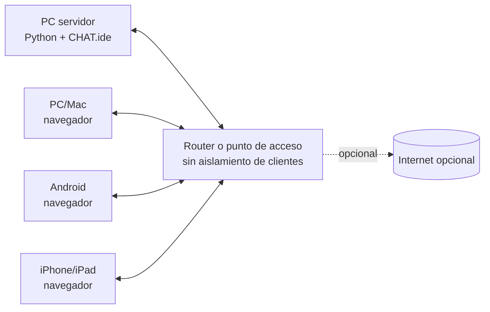

# Configuración y prueba en red local

Esta guía permite comprobar CHAT.ide con una PC servidor y navegadores conectados a la misma red. Internet es opcional y debe desconectarse durante una de las pruebas para demostrar el funcionamiento local.

## Topología esperada



“Funciona offline” significa que Internet puede faltar, pero la PC servidor y la red Wi-Fi/Ethernet local deben permanecer encendidas.

## Antes de comenzar

- Confirme que servidor y clientes están en el mismo Wi-Fi o en redes con ruta entre sí.
- Desactive el aislamiento de clientes/AP isolation en el punto de acceso de prueba.
- Evite una red de invitados que impida comunicación entre dispositivos.
- Cierre VPNs durante la primera prueba para reducir ambigüedad.
- Mantenga la PC servidor conectada a corriente y desactive temporalmente la suspensión durante la prueba.
- Use un puerto libre; el predeterminado es `8000`.

## 1. Iniciar y comprobar localmente

En la PC servidor:

```powershell
python chat_arduino.py
```

Este comando inicia la línea base estable. `chat_arduino_v2.py` es una candidata en revisión; cuando se pruebe debe indicarse explícitamente en el registro para no mezclar resultados entre versiones.

Abra primero:

```text
http://localhost:8000
```

Entre con un nombre y confirme que aparece `Conectado`. Si esto falla, el problema no es la LAN: revise la consola, la instalación de Python y si el puerto está ocupado.

## 2. Elegir la dirección LAN

El programa imprime las IPv4 que detecta. Normalmente la dirección correcta se parece a:

```text
192.168.x.x
10.x.x.x
172.16.x.x a 172.31.x.x
```

No basta con que una dirección sea “privada”: WSL, Hyper-V, Docker y algunas VPN también crean redes privadas que el celular no puede alcanzar. Elija la dirección de la interfaz física `Wi-Fi` o `Ethernet` que comparte la red con los alumnos.

En Windows se puede contrastar con:

```powershell
ipconfig
```

La mejora para filtrar adaptadores virtuales se desarrolla por separado. Hasta que se integre, conserve la URL impresa y el nombre de la interfaz utilizada en el registro de prueba.

## 3. Firewall

El servidor escucha conexiones entrantes. Si Windows muestra un aviso, permita acceso únicamente en la red/perfil autorizado por la institución. No abra el puerto para redes públicas ni cambie políticas administradas sin autorización.

Si `localhost` funciona pero ningún otro dispositivo entra, las causas más probables son:

1. regla entrante ausente o aplicada al perfil equivocado;
2. IP de un adaptador virtual;
3. aislamiento de clientes en el router;
4. servidor y celular en SSID/subredes diferentes;
5. VPN o software de seguridad que intercepta la conexión.

No configure port forwarding, DMZ ni UPnP para resolver una prueba LAN.

## 4. Entrar desde otro dispositivo

En el navegador del cliente escriba exactamente la URL mostrada, por ejemplo:

```text
http://192.168.0.24:8000
```

Compruebe:

- la pantalla de ingreso aparece sin advertencias de recurso faltante;
- cada dispositivo puede elegir un nombre;
- ambos aparecen en la lista de conectados;
- los mensajes viajan en ambos sentidos;
- un nombre duplicado recibe sufijo;
- al apagar y volver a encender Wi-Fi, el navegador intenta reconectarse;
- en móvil se puede escribir y enviar con el teclado en vertical y horizontal.

## 5. Demostrar que Internet no es necesario

La prueba preferida es retirar únicamente la salida WAN del router, sin apagar el Wi-Fi local:

1. Mantenga abierta una conversación entre al menos dos dispositivos.
2. Desconecte la salida a Internet del router o use una red de prueba sin WAN.
3. Envíe mensajes en ambos sentidos durante varios minutos.
4. Recargue la página desde un dispositivo para demostrar que HTML, CSS y JavaScript se sirven localmente.
5. Registre el resultado.

Desactivar el Wi-Fi del servidor no demuestra modo offline: elimina también la LAN que transporta el chat.

## Registro de prueba física

Copie esta tabla en el issue o pull request correspondiente:

| Dato | Resultado |
|---|---|
| Fecha y responsable | |
| Sistema de la PC servidor | |
| Versión de Python | |
| Programa probado (`chat_arduino.py` o `chat_arduino_v2.py`) | |
| Interfaz e IP elegida | |
| Puerto | |
| Tipo de router/hotspot | |
| Internet conectado/desconectado | |
| Dispositivo cliente 1 + navegador | |
| Dispositivo cliente 2 + navegador | |
| Carga inicial | Pasa/Falla |
| Mensajes en ambos sentidos | Pasa/Falla |
| Lista de conectados | Pasa/Falla |
| Nombre duplicado | Pasa/Falla |
| Reconexión | Pasa/Falla |
| Recarga sin Internet | Pasa/Falla |
| Problemas observados | |

## Alcance de rendimiento inicial

Para CHAT.ide LAN 1.0 se trabajará provisionalmente con un salón de aproximadamente 30 usuarios simultáneos y una prueba automatizada/de laboratorio con margen a 60. `ThreadingHTTPServer` conserva un hilo por conexión SSE; una meta de 150–200 usuarios o toda la escuela requiere reevaluar el servidor antes de continuar la modularización.

## Problemas conocidos de la interfaz móvil

- El chat es utilizable por debajo de 760 px, pero la lista lateral de conectados se oculta.
- No existe todavía QR de ingreso.
- El estado actual indica conexión al servidor, pero aún no muestra literalmente `LAN ACTIVA`.
- La suspensión agresiva de una pestaña móvil puede forzar una reconexión al volver.

Estos puntos deben registrarse, no resolverse mezclados con la primera prueba de red.

## Cierre seguro

Detenga el servidor con `Ctrl+C`. Confirme que la consola muestra `Chat cerrado`. El historial actual vive en memoria y se perderá; esto es esperado en el prototipo.
